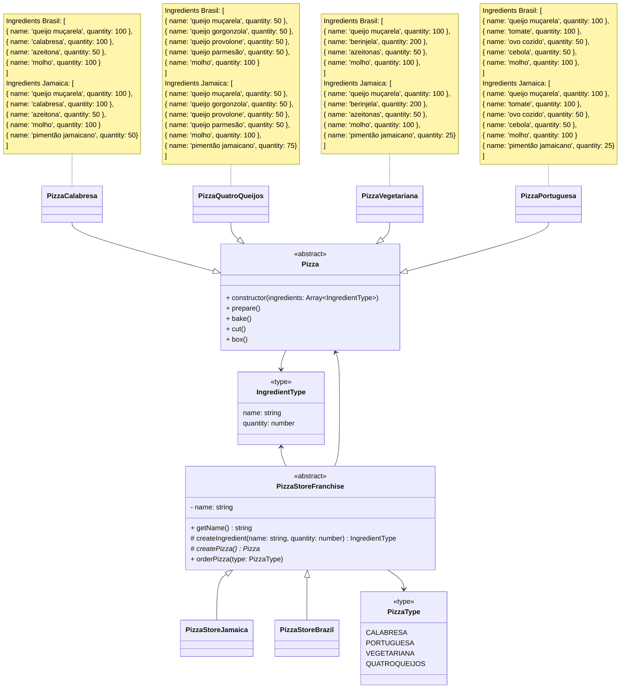
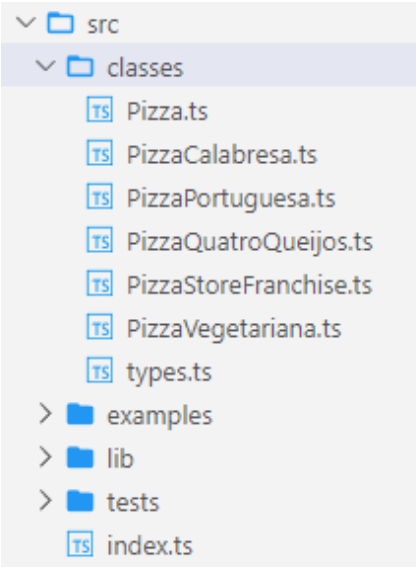

Atividade: Implementar o
padrão Factory Method

| | | 
|-|-|
|Disciplina | Padrões de Projeto
|Termos | TypeScript; CLI; StackBlitz; Programação Orientada a Objetos; Padrões de Projeto; Factory Method

Instruções da Versão 1 - Sem o padrão Factory Method
Você é o desenvolvedor de um software para controlar a produção de pizzas
numa franquia de pizzarias. O design do estrutura do programa foi feito conforme
o digrama de classes abaixo:



Implemente os tipos e classes. Os tipos devem estar um arquivo separado, de
onde devem ser exportados. Quando necessário, os demais arquivos importarão
esses tipos. As classes devem sem declaradas em arquivos próprios (um arquivo
para cada classe).



Atividade: Implementar o padrão Factory Method 4
A classe PizzaStoreFranchise possui um método para pedir uma pizza ( orderPizza ).
Ele deve receber o tipo da pizza como parâmetro: PizzaType . Veja no diagrama
quais tipos de pizza estão disponíveis. Nesse método, você deve verificar qual é a
pizza solicitada e instanciar um objeto da pizza correta passando os seus
ingredientes. Depois de instanciar a pizza, você deve prepará-la chamando os
métodos prepare , bake , cut e box (nessa ordem). Por fim, o método retorna a
pizza pronta.

O construtor de cada tipo de pizza deve imprimir no terminal uma mensagem
informando a pizza que está sendo preparada e quais os seus ingredientes. Os
métodos prepare , bake , cut e box também devem imprimir uma mensagem
informando a etapa de preparação.

Atividade: Implementar o padrão Factory Method 5
Abaixo está o código do arquivo index.ts

```typescript
import { promptSelect } from './lib/prompts.js';
import { PizzaStoreFranchise } from './classes/PizzaStoreFranchi'
let eunaPizza = new PizzaStoreFranchise('Eunápolis/BRASIL');
let option: number = -1;
while (option !== 4) {
    option = await promptSelect({
    message: 'Escolha uma pizza',
    choices: [
        'CALABRESA',
        'PORTUGUESA',
        'QUATRO QUEIJOS',
        'VEGETARIANA',
        'Sair',
    ],
});
switch (option) {
    case 0:
        console.log('=====================');
        eunaPizza.orderPizza('CALABRESA');
        console.log('=====================');
    break;
    case 1:
        console.log('=====================');
        eunaPizza.orderPizza('PORTUGUESA');
        console.log('=====================');
    break;
    case 2:
        console.log('=====================');
        eunaPizza.orderPizza('QUATROQUEIJOS');
        console.log('=====================');
    break;
    case 3:
        console.log('=====================');
        eunaPizza.orderPizza('VEGETARIANA');
        console.log('=====================');
    break;
    }
}
```
Salve essa versão do seu projeto para ser entregue. Você pode utilizar a opção
de baixar o código do projeto (ícone da nuvem) ou criar um repositório do projeto
e fazer um commit.

Atividade: Implementar o padrão Factory Method 7
Instruções da Versão 2 - Usando o padrão Factory Method
A franquia de pizzarias cresceu exponencialmente e se tornou internacional.
Agora o seu sistema deve tratar de pizzarias nos mais diversos países e elas
estão aparecendo a cada dia (o que faz com que você precise alterar o seu
código constantemente). Um desse locais é a cidade de Kingston, na Jamaica. Lá,
as pizzas da franquia possuem ingredientes e preparação um pouco diferentes.
Por esse motivo, você precisou criar novas classes PizzaCalabresaJamaica ,
PizzaQuatroQueijosJamaica , PizzaVegetarianaJamaica e PizzaPortuguesaJamaica . Em seguida,
alterou o código da função orderPizza para verificar a cidade e o país do pedido
(que agora você recebe como parâmetros).
Porém, você percebe que, com o sucesso da franquia, esse tipo de código vai te
causar muita dor de cabeça para alterar a cada nova abertura de pizzaria. Assim,
decidiu experimentar o Factory Method.
Altere a versão 1 do seu código para que utilize o padrão Factory Method e seja
mais extensível.
O método orderPizza não deve receber nenhum parâmetro além do tipo da
pizza (substitua as demais expressões condicionais pela hierarquia de classes
adequada).
Você deve criar as mesmas quatro pizzas que já existiam na versão brasileira,
agora na versão jamaicana. A versão jamaicana possui todos os ingredientes
das pizzas brasileiras com a adição do “pimentão jamaicano”.
A classe PizzaStoreFranchise é agora abstrata. A classe PizzaStoreBrazil deve
criar as pizzas brasileiras e a classe PizzaStoreJamaica deve criar as pizzas
jamaicanas.

Atividade: Implementar o padrão Factory Method 8

Lembre-se de alterar o código cliente ( index.ts ) para utilizar a
PizzaStoreJamaica .

Depois de finalizada todas as alterações, altere também o diagrama do Mermaid
no arquivo do projeto para refletir o novo código atual da aplicação. Salve essa
versão do projeto e o entregue junto com a primeira versão (via arquivo
compactado no Google Classroom).  